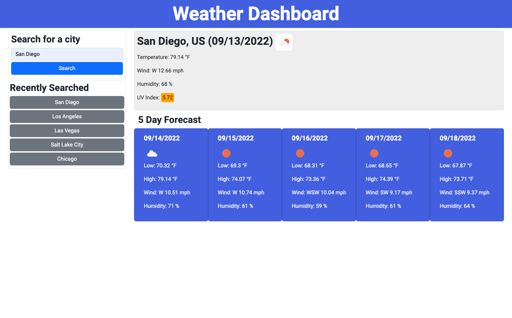

# Weather-Dashboard

## Weather Dashboard Using OpenWeather API

This tool allows the user to enter a city to view today's weather conditions as well as a five-day forecast for that city. When the page is first loaded, it looks for any history stored in local storage and displays the history. When a city name is entered and submitted with the search button or by hitting enter, the city name is submitted to the Geocoding API to retrieve the latitude, longitude, and the proper city name (with correct capitalization).

This data is then used to fetch weather and forecast data using the OpenWeather Open Call API 3.0, and the current weather conditions as well as the 5-day forecast are displayed on the page.

The list of recently searched cities are also populated as buttons that can be pressed to display the current weather and the five-day forecast.

Link to the site: https://jsp220.github.io/Weather-Dashboard/

